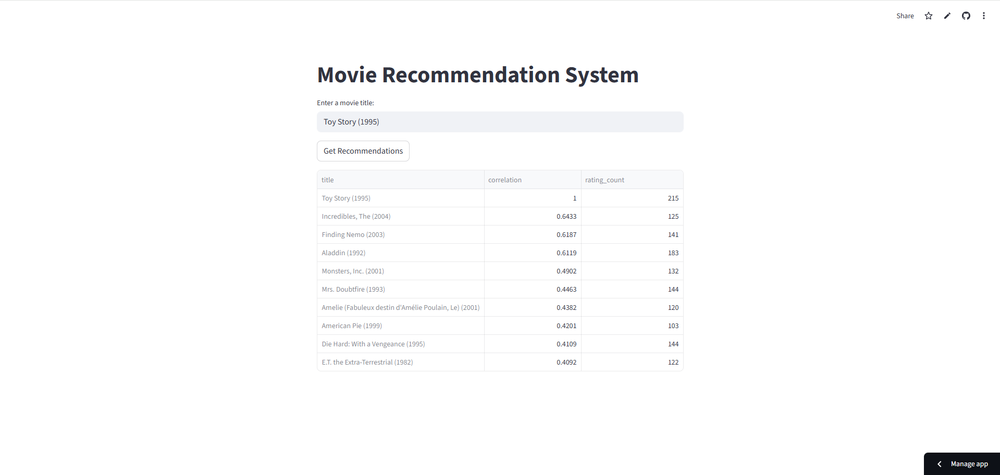

# Movie Recommendation System

## Overview

This project builds a movie recommendation system that suggests similar movies based on user preferences.

The goal of the project is to demonstrate how recommendation systems work using collaborative filtering and movie similarity analysis based on user rating correlations.

A Streamlit web application is included so users can interact with the recommendation engine and instantly receive similar movie suggestions.

---

## Live Demo

Try the interactive web application:

https://movie-recommendation-khatantamir.streamlit.app

Users can enter a movie title and instantly receive recommended movies based on similarity.

---

## App Preview

---

## Dataset

This project uses the MovieLens dataset, which is one of the most widely used datasets for recommendation systems.

Main files used:

- data/raw/movies.csv — movie titles and genres
- data/raw/ratings.csv — user ratings for movies

The dataset contains thousands of movies and user ratings that allow the recommendation model to identify relationships between movies.

Data preprocessing steps include:

- merging movie metadata with ratings
- removing missing values
- filtering movies with very low rating counts

---

## Recommendation Method

The recommendation engine uses collaborative filtering based on user rating correlations.

Steps used in the recommendation pipeline:

1. Load movie and ratings datasets
2. Merge movie titles with rating data
3. Create a user–movie rating matrix
4. Compute similarity between movies using Pearson correlation
5. Filter movies with enough rating counts
6. Return the most similar movies to the selected movie

---

## Evaluation

Recommendation quality was evaluated using:

- correlation strength between movies
- number of ratings per movie
- similarity ranking

Example output:

Input Movie  
Toy Story (1995)

Recommended Movies

Incredibles, The (2004)  
Finding Nemo (2003)  
Aladdin (1992)  
Monsters, Inc. (2001)  
Mrs. Doubtfire (1993)

---

## Visualization

Exploratory data analysis was performed to better understand the dataset and movie relationships.

Analysis includes:

- movie rating distribution
- popularity of movies based on rating counts
- similarity correlations between movies

EDA visualizations can be found in the notebooks folder.

---

## Project Structure

movie-recommendation-system-khatantamir

app  
 └── app.py

data  
 └── raw  
     ├── movies.csv  
     └── ratings.csv

models

notebooks  
 └── exploration.ipynb

src  
 └── recommender.py

requirements.txt  
README.md

---

## Technologies Used

Python  
pandas  
numpy  
scikit-learn  
Streamlit  
Jupyter Notebook

---

## How to Run

Clone the repository:

git clone https://github.com/Khatantamir/movie-recommendation-system-khatantamir.git

Install dependencies:

pip install -r requirements.txt

Run the Streamlit application:

streamlit run app/app.py

---

## Business Value

Recommendation systems are widely used in modern digital platforms such as Netflix, Amazon, Spotify, and YouTube.

This project demonstrates how businesses can:

- personalize user experiences
- improve product discovery
- increase user engagement
- increase revenue through better recommendations

---

## Future Improvements

Possible improvements for this project include:

- hybrid recommendation systems
- deep learning recommendation models
- real-time recommendation APIs
- large-scale deployment

---

## Author

Khatantamir Otgonbyamba  
Data Science / Machine Learning Portfolio Project
